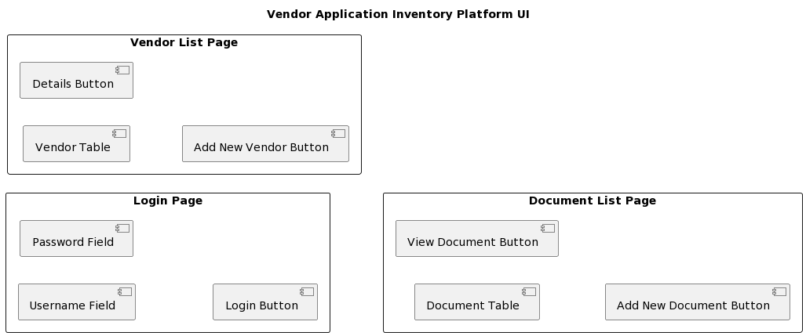
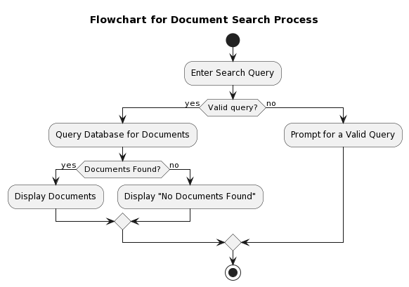

# Vendor Application Inventory Platform

## Overview

The Vendor Application Inventory Platform (VAIP) is a comprehensive solution designed to streamline the management of vendor applications in financial services consultancies. The platform aims to address the challenges of decentralized and disjointed vendor information by providing a centralized data repository with an intuitive user interface.

## Table of Contents

- [Overview](#overview)
- [Table of Contents](#table-of-contents)
- [Database Schema](#database-schema)
- [UI Layout](#ui-layout)
- [Use Case Diagram](#use-case-diagram)
- [Activity Diagram](#activity-diagram)
- [Flowchart](#flowchart)
- [Sequence Diagram](#sequence-diagram)
- [Implementation Description](#implementation-description)
- [Application Functionality](#application-functionality)
- [Integration Strategies](#integration-strategies)
- [Testing Log](#testing-log)
- [Conclusion](#conclusion)

## Database Schema

The database schema is designed using a relational model to manage and relate structured and unstructured data about vendors, products, and related documents.

## UI Layout

The user interface (UI) of VAIP is designed to provide ease of navigation, search functionality, and a responsive design for a seamless user experience.

## Use Case Diagram

The use case diagram outlines the interactions between users and the system, distinguishing between general users and administrators.

## Activity Diagram

The activity diagram illustrates the process of adding a new vendor to the platform.

## Flowchart

The flowchart shows the logical order of operations for the document search process.

## Sequence Diagram

The sequence diagram represents the interaction between the user, search interface, database, and vendor details page during the vendor details viewing process.

## Implementation Description

### Technical Challenges and Solutions

1. **Database Complexity and Scalability**: 
   - **Challenge**: Designing a database schema that caters to complex relationships and future growth.
   - **Solution**: Using MySQL and schema normalization to reduce redundancy and ensure data integrity.

2. **User Interface Responsiveness and Usability**: 
   - **Challenge**: Balancing simplicity at the input level with sophistication at the output level.
   - **Solution**: Using a modular design approach with Bootstrap for full responsiveness.

3. **Secure Authentication and Authorization**: 
   - **Challenge**: Protecting the platform with secure entry and defined access levels.
   - **Solution**: Implementing role-based access control with Django's authentication framework.

### Integration of Frontend, Backend, and Database

- **Challenge**: Ensuring seamless integration from frontend to backend and database.
- **Solution**: Using Django's MTV architectural pattern for high separation of concerns and easy integration.

## Application Functionality

### Key Features Overview

- **Vendor Information Management**: Store, retrieve, and analyze both structured and unstructured vendor data.
- **User Profiles and Permissions**: Different roles for general users and administrators.
- **Search and Filter Capabilities**: Powerful search and advanced filtering options.
- **Security Measures**: SSL encryption, hashed passwords, and AES-256 encryption for data security.

## Integration Strategies

- **Frontend and Backend Integration**: Utilizing Django's ORM and RESTful APIs for seamless data flow and dynamic UI updates.
- **Data Handling**: Implementing page-wise lazy loading and optimizing SQL queries for handling large volumes of data.

## Testing Log

### Methodology and Tools Utilized for Testing

- **Unit Testing**: Using Django's built-in testing framework for individual functions and models.
- **Integration Testing**: Using Selenium WebDriver for automated browser testing.
- **User Acceptance Testing (UAT)**: Testing by selected target audience for user feedback.

### Summary of Test Cases and Outcomes

- **User Authentication and Authorization**: Successfully authenticated users with valid credentials.
- **Vendor and Product Management**: CRUD operations performed without issues.
- **Document Management**: Managed documents seamlessly, resolved large file upload issues.
- **Search Functionality**: Accurate search results with improved response times.
- **User Role Restrictions**: Correct implementation of access control.

## Conclusion

The Vendor Application Inventory Platform (VAIP) addresses the inefficiencies of decentralized vendor information management by providing a centralized, accessible, and efficient repository. With a user-friendly interface, robust search and filtering capabilities, and strong security measures, VAIP enhances decision-making processes and operational efficiency in financial services consultancies. The platform is poised for continuous improvement to meet evolving industry needs.